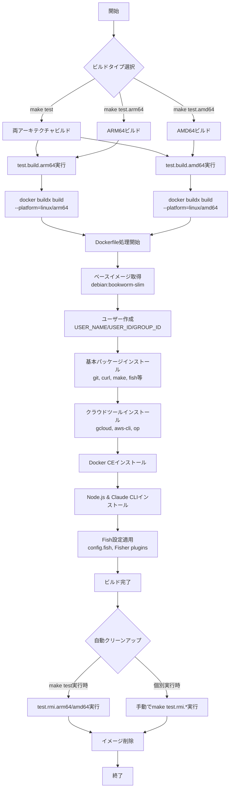
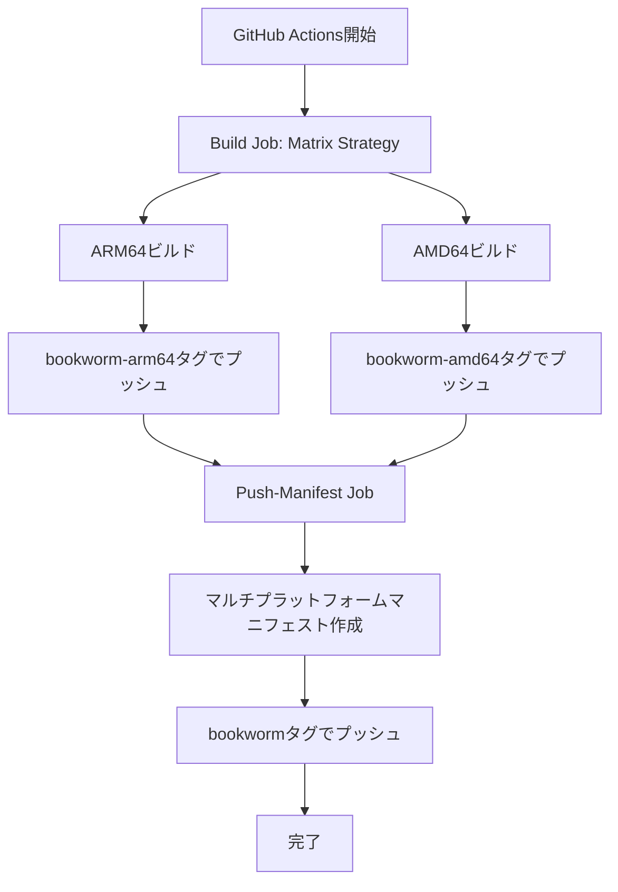

# dot-devcontainer-debian-fish-bookworm
Create docker container 'ghcr.io/bearfield/debian-fish:bookworm' for development.

## 特徴

### 開発ツール
- **JSON/YAML処理**: jq, yq
- **ファイル操作**: tree, zip/unzip
- **API テスト**: httpie
- **その他**: git, curl, make, peco, fish shell

### クラウドツール
- Google Cloud SDK
- AWS CLI
- 1Password CLI
- Docker CE

### 開発環境
- Node.js & Claude Code CLI
- Fish shell with bobthefish theme
- VS Code Extensions (GitHub Copilot, Claude Code, etc.)

## ビルドフロー

以下はこのプロジェクトのDockerイメージビルドプロセスを示すフロー図です：



## ビルドコマンド詳細

### 全アーキテクチャテスト
```bash
make test
```
ARM64とAMD64の両方をビルドし、完了後に自動的にクリーンアップします。

### 個別アーキテクチャテスト
```bash
# ARM64のみ
make test.arm64

# AMD64のみ
make test.amd64
```

### ビルドのみ（クリーンアップなし）
```bash
# ARM64
make test.build.arm64

# AMD64
make test.build.amd64
```

### 手動クリーンアップ
```bash
# ARM64イメージ削除
make test.rmi.arm64

# AMD64イメージ削除
make test.rmi.amd64
```

## ビルドカスタマイズ

### ビルド引数の使用
コンテナ内のユーザー名やUIDをカスタマイズできます：

```bash
# ローカルビルド時の例
make test USER_NAME=myuser USER_ID=1001 GROUP_ID=1001

# 特定のアーキテクチャのみ
make test.arm64 USER_NAME=myuser USER_ID=1001
```

### デフォルト値
- `USER_NAME`: devuser
- `USER_ID`: 1000
- `GROUP_ID`: 1000

### 環境変数の設定
`.env.example`をコピーして`.env`を作成し、デフォルト値をカスタマイズできます：

```bash
cp .env.example .env
# .envファイルを編集してカスタマイズ
```

### GitHub Actionsでのカスタマイズ
リポジトリの設定で以下の変数を設定できます（Settings → Secrets and variables → Actions → Variables）：

- `CONTAINER_USER_NAME`: コンテナ内のユーザー名
- `CONTAINER_USER_ID`: ユーザーID
- `CONTAINER_GROUP_ID`: グループID（設定しない場合はUSER_IDと同じ値）

これらの変数を設定することで、GitHub Actionsでビルドされるイメージをカスタマイズできます。

## CI/CD

このプロジェクトはGitHub Actionsを使用して自動ビルドを行います。

### 自動ビルドトリガー
- mainブランチへのプッシュ時
- 毎日18:00 UTC（日本時間3:00）

### 並列ビルドアーキテクチャ
GitHub Actionsワークフローは、マトリックスビルド戦略を使用してマルチプラットフォームイメージを並列で作成します：



この並列アプローチにより、ビルド時間が約半分に短縮されます。